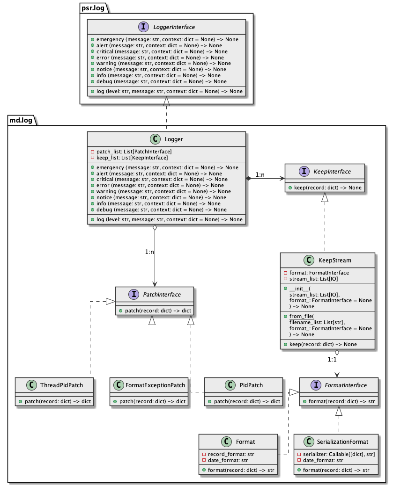

# Documentation
## Overview

md.log is the simplest [psr.log](../psr.log) contract implementation component 
that provides API to perform application logging.

## Architecture overview



## Installation

```sh
pip install md.log --index-url https://source.md.land/python/
```

## Usage example

```python3
#!/usr/bin/env python3
import md.log


if __name__ == '__main__':
    # arrange
    logger = md.log.Logger(handler_list=[
        md.log.DefaultHandler(filename='/tmp/my-app.log')
    ])

    # act
    logger.emergency('Application log', {'context-example': 42})
    logger.alert('Application log', {'context-example': 42})
    logger.critical('Application log', {'context-example': 42})
    logger.error('Application log', {'context-example': 42})
    logger.warning('Application log', {'context-example': 42})
    logger.notice('Application log', {'context-example': 42})
    logger.info('Application log', {'context-example': 42})
    logger.debug('Application log', {'context-example': 42})
    
    logger.log(level='custom-level', message='Application log', context={'context-example': 42})
```

```
# cat /tmp/my-app.log
[2021-07-27 17:23:17.403825] app.EMERGENCY: Application log {"context-example": 42}
[2021-07-27 17:23:17.404138] app.ALERT: Application log {"context-example": 42}
[2021-07-27 17:23:17.404974] app.CRITICAL: Application log {"context-example": 42}
[2021-07-27 17:23:17.405162] app.ERROR: Application log {"context-example": 42}
[2021-07-27 17:23:17.405231] app.WARNING: Application log {"context-example": 42}
[2021-07-27 17:23:17.405291] app.NOTICE: Application log {"context-example": 42}
[2021-07-27 17:23:17.405347] app.INFO: Application log {"context-example": 42}
[2021-07-27 17:23:17.405410] app.DEBUG: Application log {"context-example": 42}
[2021-07-27 17:23:17.405462] app.CUSTOM-LEVEL: Application log {"context-example": 42}
```
