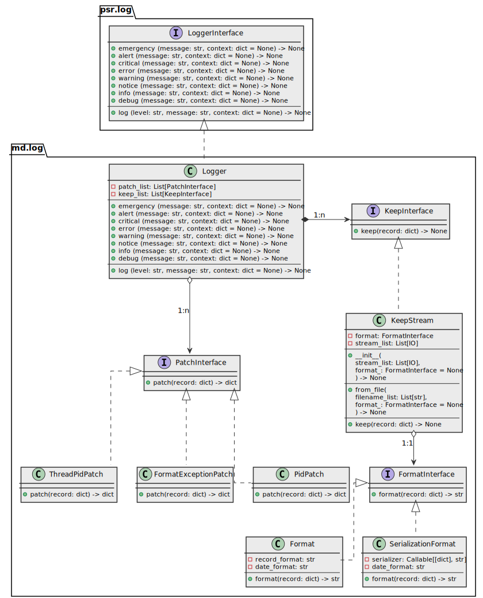

# md.log

md.log is advanced [psr.log 2](../psr.log) contract implementation component 
that provides API to perform application logging.

## Architecture overview



## Install

```sh
pip install md.log --index-url https://source.md.land/python/
```

## [Documentation](docs/index.md)

Read documentation with examples: https://development.md.land/python/md.log/

## Integration with [md.di](../md.di/)

Take a look for [md.bridge.di_log](../md.bridge.di.log/) that simplifies 
dependency initialization and integration into application built on top of [md.di](../md.di/)

# [Changelog](changelog.md)
# [License (MIT)](license.md)
